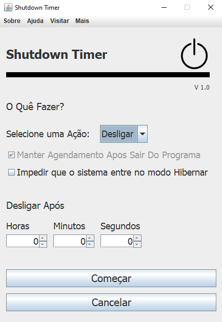

# Shutdown-Timer 1.0

</img>

# Requisitos / Usar

Requisitos:

para usar qualquer aplicação java voçê precisa ter a 'JRE' Java Runtime Environment -> 'ambiente de execução java', instalada no seu computador!
usada para para executar as aplicações da plataforma Java. <a href="https://www.java.com/pt-BR/download/manual.jsp">DOWNLOAD JAVA JRE</a>

Usar: Para usar é bem simples basta executar o arquivo 'ShutdownTimer.exe'. ou use a verção 'ShutdownTimer.jar' que se encontra na pasta 'dist'.
